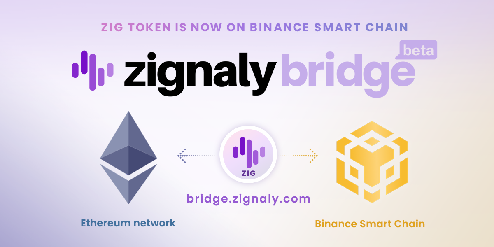
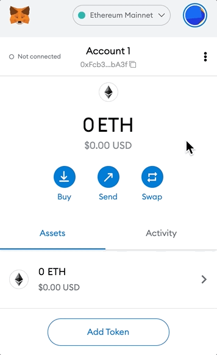
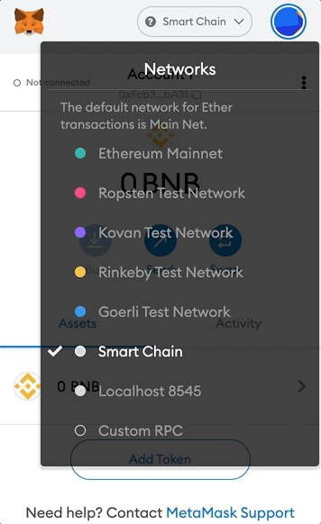
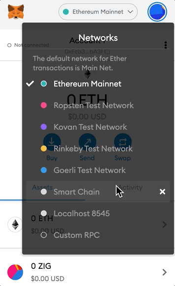
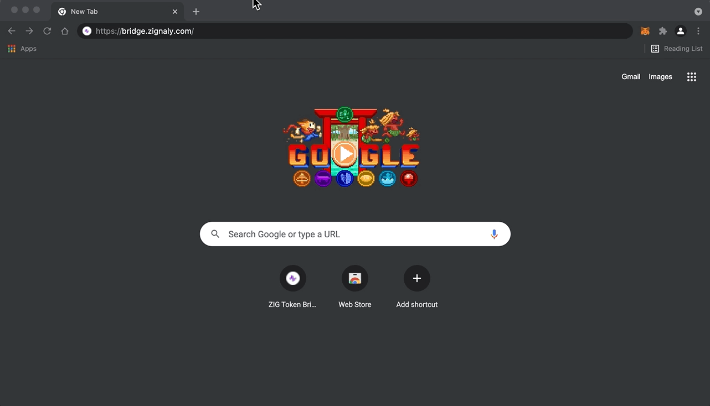
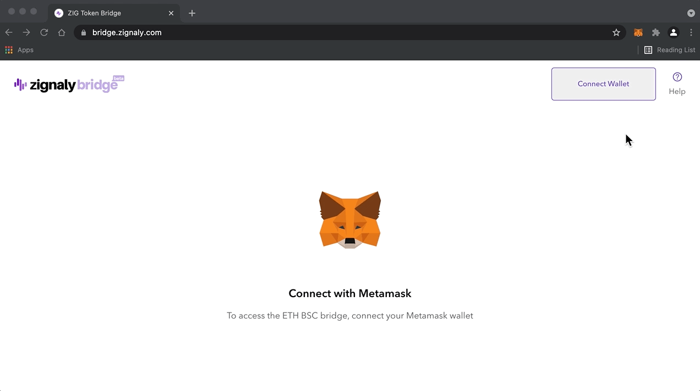
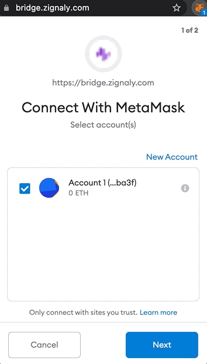

# How to migrate ZIG from Ethereum Mainnet to Binance Smart Chain

All you need to know on migrating your ZIG from Ethereum Mainnet to the Binance smart chain:

We committed to it, and now is the time to deliver! ZIG supports BSC ([Binance Smart Chain](https://www.binance.org/en/smartChain)), which means the doors to a super-efficient network are open to the ZIG Holders & Traders!

BSC has a few inherent advantages over the Ethereum Mainnet. One of the main advantages is **remarkably lower gas fees**, which makes transactions and operations efficient to an unparalleled level. The BSC ecosystem is flourishing with more assets added each passing day. To take full advantage of the BSC ecosystem, you’ll need to convert your ZIG tokens from the Ethereum side ofthe [ZIG Token Bridge](https://bridge.zignaly.com/) and then claim them on the BSC side.

To start exploring ZIG on BSC, head over to [ZIG Token Bridge](https://bridge.zignaly.com/) and follow the guide below:

## **Setting up and funding Metamask browser extension:**

### Step 1) Install Metamask

Go to [www.metamask.io](http://www.metamask.io/) and select from Android or iOS for mobile application and select Chrome for desktop. *(Source:* [*https://metamask.io/faqs.html*](https://metamask.io/faqs.html)*)*

### **Step 2) Add Binance Smart Chain to Metamask, if you haven’t already —** Since BSC network is not available by default on Metamask, this step will demonstrate how to add it manually.

Open the Metamask browser extension to begin.

Expand the network selection menu and select ‘Custom RPC’.

Use the configurations shared below to populate the custom RPC form and click ‘Save’:

**Network Name:** Smart Chain

**New RPC URL:** https://bsc-dataseed.binance.org/

**Chain ID:** 56

**Symbol:** BNB

**Block Explorer URL:** [https://bscscan.com](https://bscscan.com/)

*(Source:* [*https://academy.binance.com/en/articles/connecting-metamask-to-binance-smart-chain*](https://academy.binance.com/en/articles/connecting-metamask-to-binance-smart-chain)*)*

Once done, ‘Smart Chain’ should appear in the Network list.

**Step 3) Adding ZIG to Ethereum Mainnet —** Switch to Ethereum, and proceed to add ZIG using the following configuration:

ZIG ERC20 Contract address: 0x7bebd226154e865954a87650faefa8f485d36081

Token symbol: ZIG

Decimal: 18

*(Note: ‘Token symbol’ and ‘Decimal’ should be automatically detected upon entering the correct token contract address)*

ZIG’ should now appear under the asset list on Ethereum Mainnet.

**Step 4) Adding ZIG to the BSC Mainnet:** Switch to BSC, and add ZIG using the following configuration:

ZIG BSC Contract address: 0x8C907e0a72C3d55627E853f4ec6a96b0C8771145

Token symbol: ZIG

Decimal: 18

*(Note: ‘Token symbol’ and ‘Decimal’ should be automatically detected upon entering the correct token contract address)*

“ZIG” should now appear under the asset list on BSC Mainnet.

**Step 5) Connecting Metamask to Bridge:**

Go to https://bridge.zignaly.com/

Click ‘Connect Wallet’ in the top right corner, and select MetaMask.

Accept connection in MetaMask wallet:

At this point, the wallet is connected to the Bridge. However, there is a one-time setup that we’ll demonstrate in the next step.

**Step 6) Approve Metamask/Bridge permissions to spend ZIG:**

One-time setup cost included for ERC20 and BSC networks, hence the wallets should have sufficient ETH and BNB, respectively, to cover the gas fees.

ERC20 — Make sure you are on the Ethereum Mainnet:

Click “Approve Now” to grant required permissions to the bridge and Metamask.

Upon clicking ‘Confirm’, the gas fee should be deducted, granting the required permissions.

Switch the network to BSC:

Click “Approve Now” to grant required permissions to the bridge and Metamask.

Upon confirming the transaction, you will be ready to proceed with the ZIG ERC20-BSC transfer.

**Let’s jump ships from ERC20 to BSC:**
